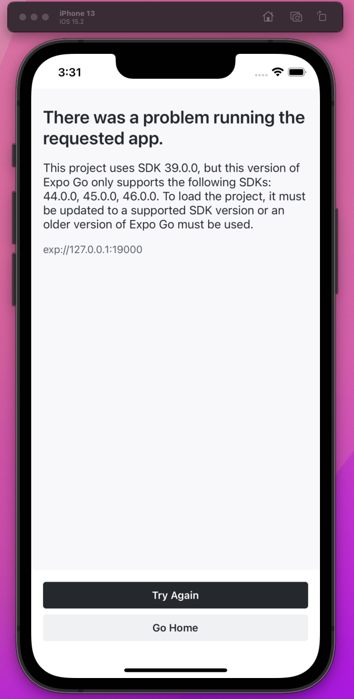

---

title: expo & expo_cli

author: Roman Vavilov

date: '2022-05-21 14:17'

---

## Run expo app in expogo client

I had this react-native application sit there for a year, when i was asked to make a little change in it. So i opened my notes on how to run react-native app in expo client in a xcode simulator and it stated:

```Shell
npm run ios
```

From this point on it's going great, it is installing expo client on the IOS Simulator but after it tries to actually launch the app this message pops up:




The reason for this, is that expo node package installs the latest client app, which is not compatible with older versions of sdk. The `expo` version itself has to match the desired sdk version. In my case it's 39.0.0.

```Shell
npm i -g expo@39.0.0
```

To fix the issue with the simulator client, you need to implicitly tell expo to install the client app:
```Shell
npx expo client:install:ios
```

`npx` is used here because this command requires the actuall `axpo-cli` package to be installed globally, which conflicts with the currently installed expo package.

After running this command it will recognize the current sdk version, and it will ask if you want to install the compatible version of the client application.

```Shell
? You are currently using SDK 39.0.0. Would you like to install client 2.17.4 released for this SDK? Y/n
```
