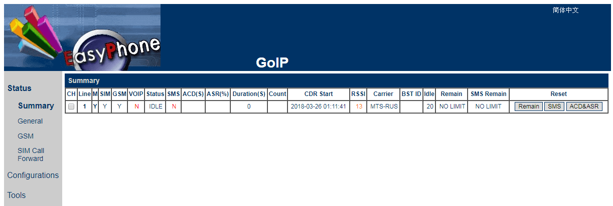
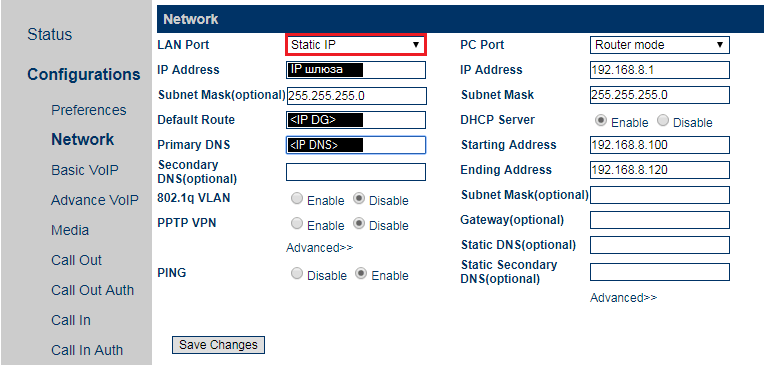

# Usefull links

Goip user manual - [should i download this?](http://static.dbltek.com/attachment/7oiqKBomRiiSmrrmnrRiwS77gwbf3zlp/GoIP-Series-User-Manual-V1.pdf)

Never used this, but might be helpful - https://itgala.xyz/connect-goip8-gsm-gateway-to-asterisk/

Might be helpful too - [asteriskdocs.org - Asterisk‚Ñ¢: The Definitive Guide](http://www.asteriskdocs.org/en/3rd_Edition/asterisk-book-html-chunk/index.html)

# Before you begin

Before installing SIM-card into the slot it has to be powered down. To do this go to the `Status` section of the admin panel and click `Y` under the `M (Module)` column.

Under the `Configurations -> Network` section the PC Port is set to Router mode, but in order to ssh into the server i had to set the PC Port to Bridge mode. TODO: Спросить у Сергея Иванова

# Instuctions

- [Setting up asterisk on Raspberry Pi](./server.md)
- [Find IP address of the device](https://linuxhandbook.com/find-ip-address/)
