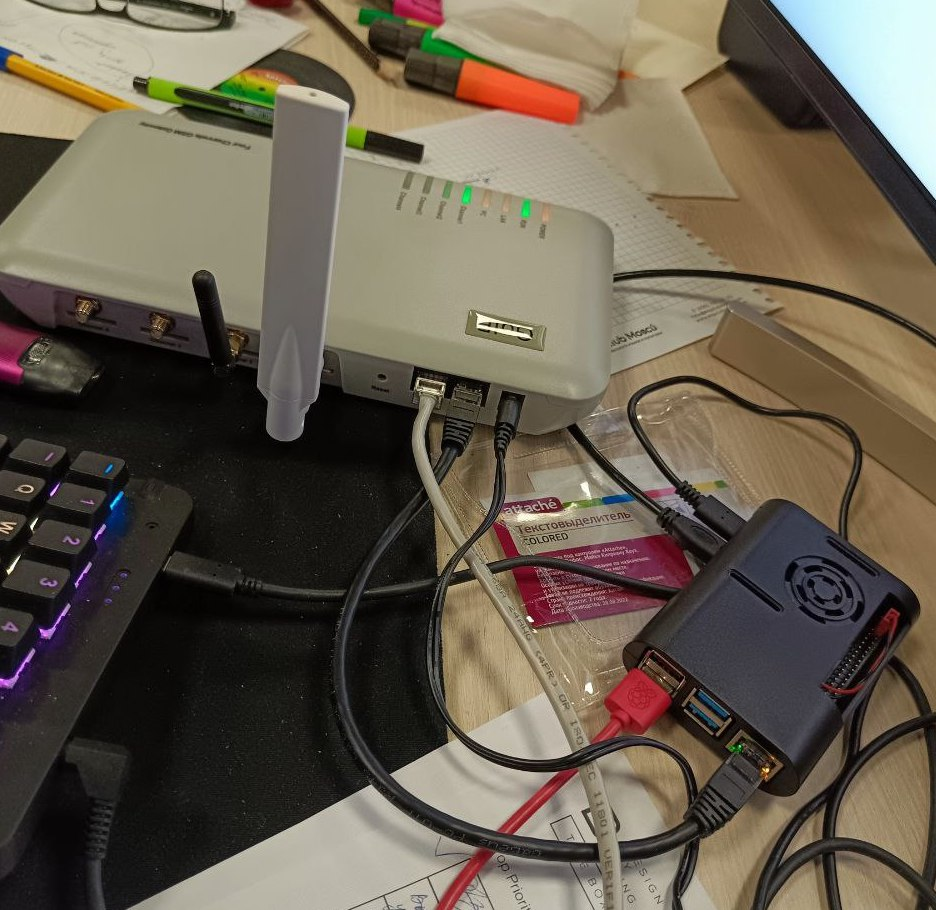

# Configuring asterisk with RasPBX on Raspberry Pi 4 (8gb RAM)

- [I simply followed steps in this video](https://www.youtube.com/watch?v=S6aQrRqJC-0&list=PLcCy_HO2ecMINv6EnGetCTsYVazVw3_kr&index=2)
- [Same as video, but in text](https://wiki.merionet.ru/ip-telephoniya/56/integraciya-goip-1-i-asterisk/)
- [Softphone config article](https://wiki.merionet.ru/ip-telephoniya/49/obzor-i-nastrojka-softfona-draytek/)

# Operating system

## FreePBX

FreePBX is debian based OS which comes preconfigured with asterisk and has a web-interface on root

Official images - https://www.freepbx.org/downloads/

## RasPBX

RasPBX is the same as FreePBX but tuned up to work on Raspberry Pi - http://www.raspberry-asterisk.org/documentation/

It has great step-by-step guid on every aspect you probably need  - https://github.com/MatejKovacic/RasPBX-install/blob/main/english.md

As of writing this, RasPBX is based on Debian 10 Bullseye, but there's a side project (not maintained) which is Debian 11 based - http://www.raspberry-asterisk.org/downloads/

